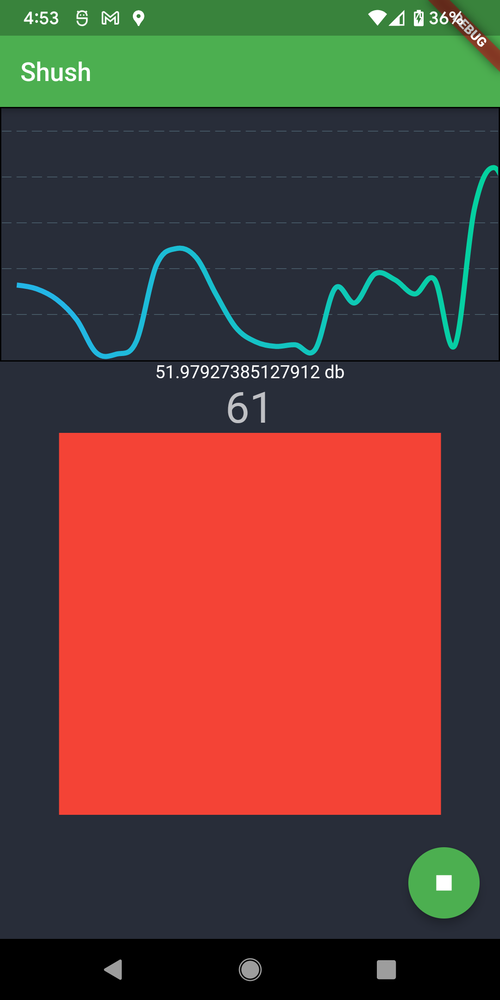

# Shush (a flutter app)

I live with someone who goes to sleep much earlier than I do. This combined with my habit of playing games with friends late at night and my particularly loud voice presents a problem that can cause a great deal of frustration. Luckily I've developed my way out of this problem by creating this app: "Shush". The purpose of the app is to monitor volume levels so that if things get to loud (for example someone who said they would whisper for the rest of the night starts to talk loudly by accident), it alerts the user by lighting up the screen with a red box. Mainly this is a way to remind the user to be quiet when they've agreed to be quiet. This was also a perfect excuse to develop an app using flutter which I've been meaning to do for a while now.

## Features Todo List
Here are some features I want to add at some point if/when i work on this again:
- wake screen when too loud
- keep screen alive when app open
- ui for changing threshold volume
- make it work for bluetooth-connected headset
- build a stand for it for sitting on my desk and charging while showing the app
- make it beep in my headphones when im being too loud
- make it so you can rotate the screen all the way